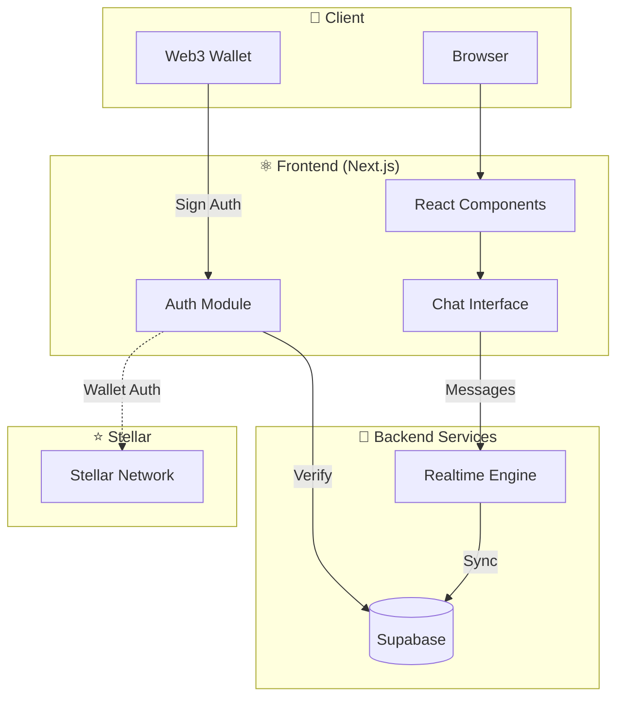

# AnonChat 🌌

**AnonChat** is a **Stellar-based anonymous communication platform** that allows users to create groups and chat freely with strangers — **without revealing identity**. Access is powered by **Web3 wallet authentication**, ensuring privacy, decentralization, and user sovereignty.

> Speak freely. Stay anonymous. Powered by Stellar.

---

## 🚀 What is AnonChat?

AnonChat is a decentralized, privacy-first chat application where:

* Users **connect using a Web3 wallet**
* No personal data, email, or phone number is required
* Users can **create or join anonymous groups**

### On-Chain Group Ownership
To improve security, each chat group is now tied to a specific Stellar wallet address. The wallet that creates a group becomes its owner, and only that wallet can change the group's metadata. When a new room is created the owner's address is saved in the database and included in the metadata hash that is submitted to the Stellar blockchain.

Updates to a group's name, description or privacy flag must be accompanied by a signature from the owner's wallet. The backend verifies the signature against the proposed new metadata and rejects unauthorized requests. This provides transparent, on-chain proof of who controls a community.

* Messages are **end-to-end encrypted**
* Identity is never exposed — not even to us

The platform leverages **Stellar blockchain primitives** to ensure transparency, decentralization, and trustless authentication.

---

## 🌟 Why Stellar?

AnonChat is **built on Stellar** because it offers:

* ⚡ **Fast & low-cost transactions**
* 🌍 **Global, borderless infrastructure**
* 🔐 **Secure public-key cryptography**
* 🧩 Perfect fit for **wallet-based authentication**

Stellar enables AnonChat to remain lightweight, scalable, and censorship-resistant.


---

## 🧩 Core Features

### 🔒 Complete Anonymity

* No usernames, emails, or profile data
* No tracking or surveillance
* Zero-knowledge architecture

### 🔐 End-to-End Encryption

* Messages are encrypted client-side
* Only chat participants can read messages

### 🌐 Decentralized Groups

* Create or join anonymous chat rooms
* No central authority or moderation bias

### 👛 Web3 Wallet Authentication

* Login using a supported Web3 wallet
* Wallet address acts as a **pseudonymous identity**

### ⚡ Lightning Fast Messaging

* Real-time chat with minimal latency

### 🛡 Privacy First

* No IP logging
* No data selling or analytics exploitation

---

## 🏗️ Tech Stack

### Frontend

* **Next.js / React**
* **Tailwind CSS**
* **Web3 Wallet Integration**

### Blockchain

* **Stellar Blockchain** ⭐
* Wallet-based authentication
* Public-key cryptography

### Backend

* Node.js / Serverless APIs
* WebSocket / Real-time messaging
* Encrypted message storage

### Hosting

* **Vercel**

---

## 🔐 Security Model

* End-to-end encrypted messages
* Zero-knowledge design
* Decentralized architecture
* Open-source codebase (auditable)
* No identity or metadata storage

---


## 🏛️ Architecture



| Layer | Technology |
|-------|------------|
| Frontend | Next.js 16, React 19, TypeScript, Tailwind CSS |
| Auth | Supabase Auth + Web3 Wallet |
| Database | Supabase (PostgreSQL) |
| Real-time | Supabase Realtime |
| Blockchain | Stellar Network |
| Hosting | Vercel |

---

## 🛠️ Quick Start

### Prerequisites

* Node.js >= 18.x
* pnpm (recommended)
* [Supabase account](https://supabase.com)

### Setup

```bash
# 1. Clone and install
git clone https://github.com/your-username/anonchat.git
cd AnonChat
pnpm install

# 2. Configure environment
cp .env.example .env.local
# Edit .env.local with your Supabase credentials

# 3. Run database migrations in Supabase SQL Editor
# scripts/001_create_profiles.sql
# scripts/002_create_profile_trigger.sql
# scripts/003_room_members_and_removal_votes.sql  (for wallet-based removal voting)

# 4. Start dev server
pnpm dev
```

### Testing wallet-based removal voting

**Full runbook:** See [docs/RUN-VOTE-REMOVE.md](docs/RUN-VOTE-REMOVE.md) for step-by-step run and verify instructions.

1. **Apply the migration**  
   Run `scripts/003_room_members_and_removal_votes.sql` in the Supabase SQL Editor so `room_members`, `room_removal_votes`, and `check_removal_threshold` exist.

2. **API smoke test** (Node ≥18, dev server on Node ≥20):  
   With the dev server running (`pnpm dev`), in another terminal:
   ```bash
   pnpm run test:vote-remove
   ```
   This checks that unauthenticated requests get 401 and invalid requests get 400.

3. **Manual UI test**  
   Open `/chat`, select a room, click the ⋮ (More) button in the header. The “Room members & voting” dialog should open; without auth you’ll see “No members yet, or you need to sign in.” After signing in and joining a room (e.g. by sending a message), you can vote to remove another member; when a majority votes, they are removed and can no longer send messages in that room.

### Environment Variables

```env
NEXT_PUBLIC_SUPABASE_URL=your-project-url
NEXT_PUBLIC_SUPABASE_ANON_KEY=your-anon-key
NEXT_PUBLIC_STELLAR_NETWORK=testnet
NEXT_PUBLIC_APP_NAME=AnonChat
```

> Find credentials in Supabase Dashboard → Settings → API

---

## 🧪 Roadmap

* [ ] Group ownership via Stellar accounts
* [ ] On-chain group identity
* [ ] DAO-based moderation
* [ ] Encrypted file sharing
* [ ] Mobile PWA support

---

## 🤝 Contributing

See [CONTRIBUTING.md](CONTRIBUTING.md) for guidelines. Quick steps:

1. Fork → Create branch `fix-[issue-number]` → Make changes → Test → PR
2. **Important**: Only submit PRs for issues you're assigned to

---

## 📜 License

This project is licensed under the **MIT License**.

---

## 🌐 Live Demo

🔗 [https://anonchat-one.vercel.app](https://anonchat-one.vercel.app)

---

## 💜 Credits

Built with privacy in mind and powered by **Stellar Blockchain**.

> If you believe communication should be free, anonymous, and decentralized — AnonChat is for you.

---

### ⭐ Don’t forget to star the repository if you like the project!
